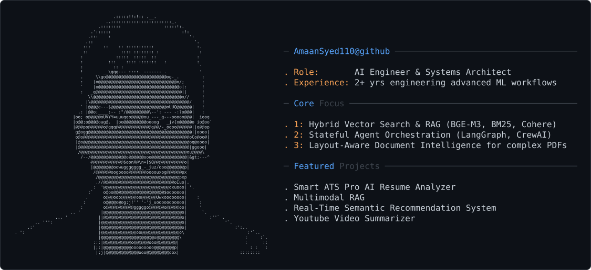

<!-- Header Section -->
<picture>
  <source media="(prefers-color-scheme: dark)" srcset="dark_profile.svg" />
  <source media="(prefers-color-scheme: light)" srcset="light_profile.svg" />
  
</picture>

  

  
  
  

  

 

## 👨‍💻 About Me

I am an **AI Engineer & Systems Architect** specializing in moving machine learning models out of isolated notebooks into scalable, fault-tolerant enterprise applications. With over 2 years of professional engineering experience, I architect advanced document intelligence platforms, sub-second vector search indices, and autonomous agent workflows.

- 💼 **Experience:** AI Engineer at **Integract Labs** | Previously AI Engineer at **Kairox**.
- 🎓 **Education:** M.Tech in Artificial Intelligence & Data Science at Somaiya Vidyavihar University *(9.20 CGPA)* | B.E in Computer Engineering *(9.06 CGPA)*.
- 🎯 **Core Focus:** Hybrid Vector Search & RAG, Layout-Aware Document Intelligence, and Stateful Agent Orchestration.
- 💬 **Ask me about:** LangGraph, CrewAI, Groq Optimization, Azure Cloud deployments, and production LLMs.

---

## ⚡ Core Engineering Focus

- **Hybrid Vector Search & RAG:** Combining dense neural embeddings (BGE-M3, OpenAI) with sparse lexical search (BM25) and Cohere Rerank v3 cross-encoders to eliminate out-of-context document retrieval.
- **Stateful Agent Orchestration:** Designing multi-agent workflows using LangGraph and CrewAI with strict Pydantic/Instructor schema validation to prevent unformatted or hallucinated model outputs.
- **Layout-Aware Document Intelligence:** Engineering multi-modal parsing pipelines for complex PDFs, spatial multi-column tables, and embedded figures with structured vision extraction.

---

## 🛠️ Tech Stack & Skills

<h3 align="center">🧠 AI, Machine Learning & Data Science</h3>

  
  
  
  
  
  

<h3 align="center">🤖 Large Language Models & GenAI</h3>

  
  
  
  
  
  
  

<h3 align="center">💻 Cloud, Architecture & DevOps</h3>

  
  
  
  
  
  

---

## 🗂️ Featured Projects

  
  

  
  
## 📈 GitHub Analytics

  
  
   
  

---

  

